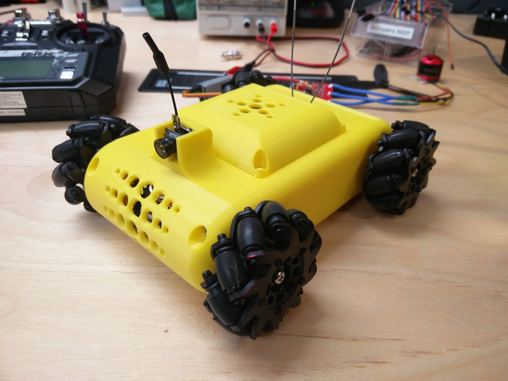
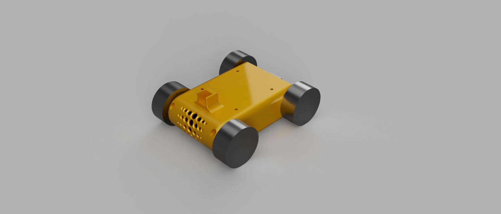

# MecanumBot

Parts list:

* Batteries, only used 3 in the end as 4 was too much voltage: https://www.banggood.com/custlink/DKvKIOFLAZ

* Transmitter and receiver, went for i6X+X6B option as it's the most useful for other projects in the future: 
https://www.banggood.com/custlink/mGvvIOHUTA
* Battery case: https://www.banggood.com/custlink/3KGv8o5l2D
* Camera and transmitter: https://www.banggood.com/custlink/vDvKIjVLqJ
* FPV goggles https://www.banggood.com/custlink/KGDK8aPlzt
* Arduino https://www.banggood.com/custlink/Dm3m9Otj2a
* 2*Hbridge https://www.banggood.com/custlink/3DGmIataMb
* Jumper cables: https://www.banggood.com/custlink/DKDvZjHj2U
* Wheels: https://ebay.us/vs8gk4
)
